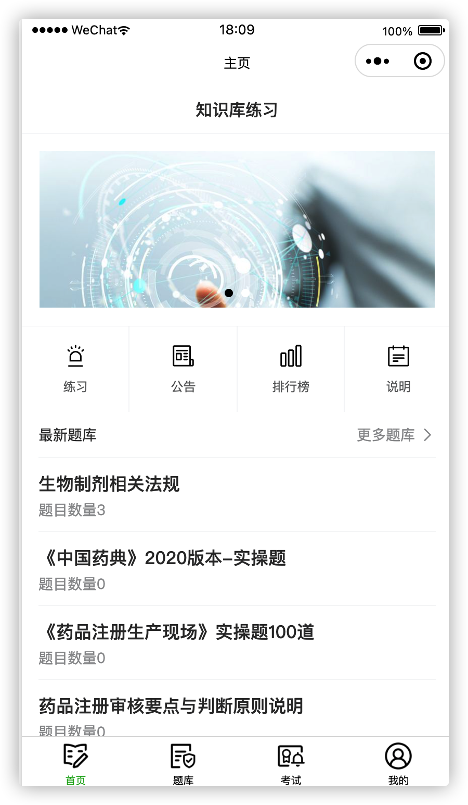
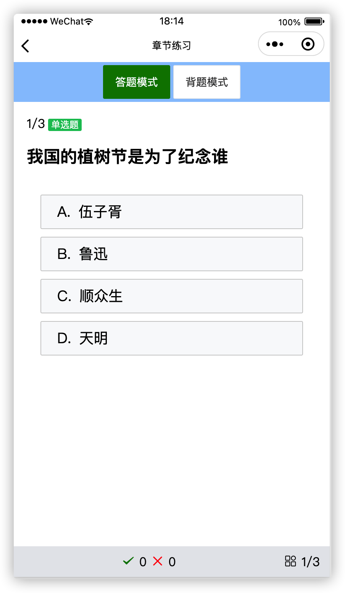
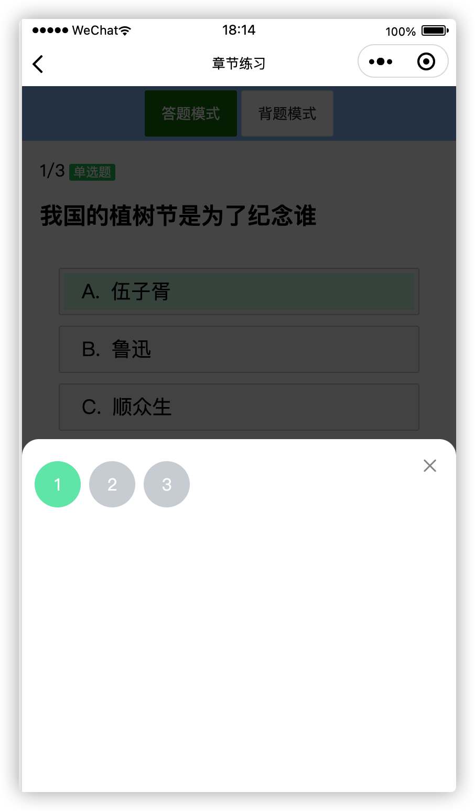
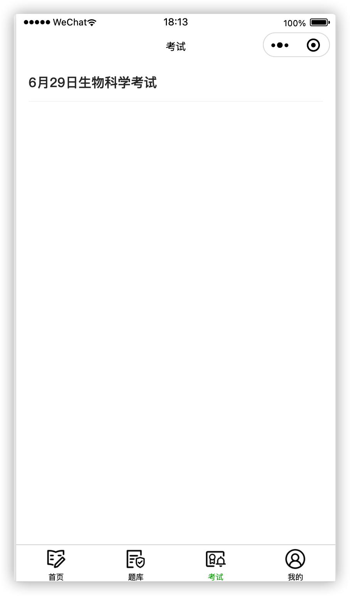
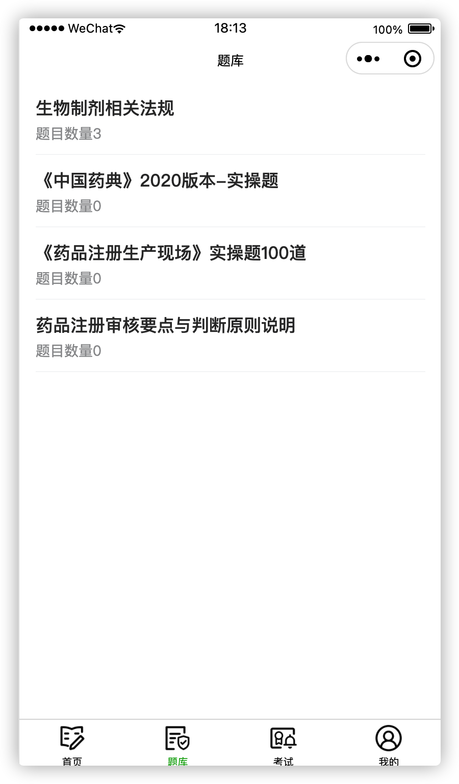
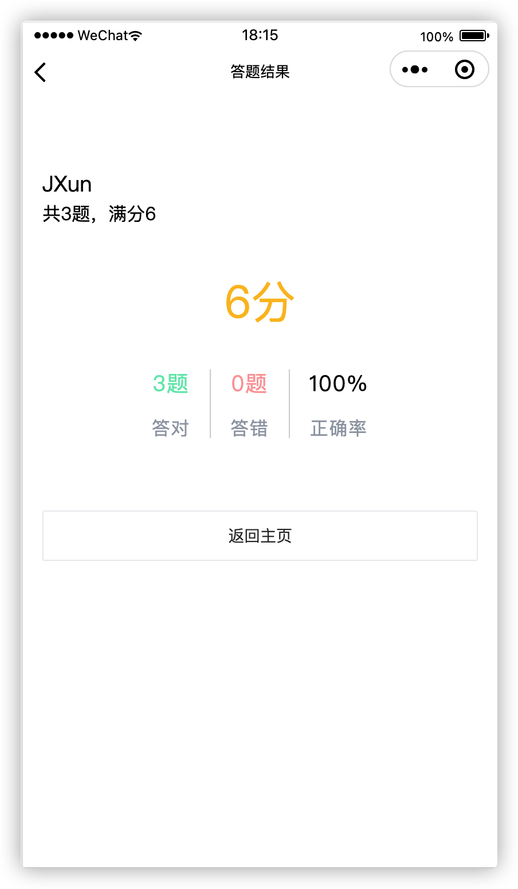
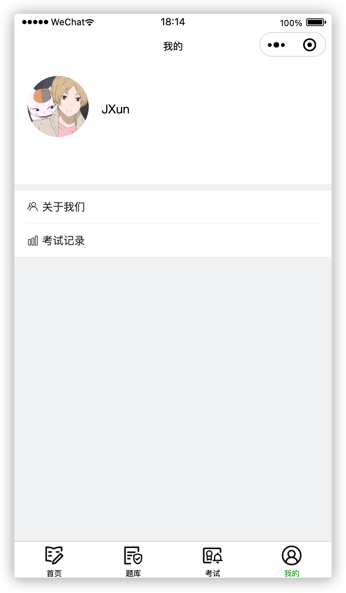
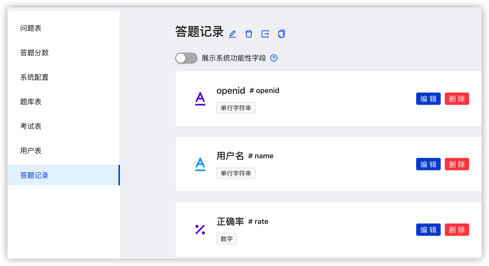
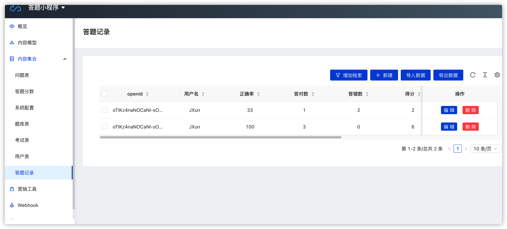

# 项目说明

1. 这是一个云开发的模版
2. 开发架构为前后端分离方式，云端选择了云函数（不在前端使用云数据库，耦合不好！）

```
项目支持单选题、多选题。
考试模式、背题模式。
帮助新手了解云开发的好项目。
喜欢的点赞，加群，奥利给！
```
# 联系交流
QQ群 ： 631830116
<br/>
有软件开发需求咨询（微信）： familyxun（免费咨询）
<br/>
关于项目的指导联系（微信）：familyxun（知识付费）

# 项目优缺点

1. 便宜，不需要后台服务器（优点）
2. 不需要开发后台管理（优点）
3. 可以快速上线，无需备案（优点）
4. 和微信生态绑定，只可以小程序（缺点）

# 集成工具说明

1. css方面集成了tailwindcss
2. 依赖包方面集成lodash
3. 引入dayjs

# 管理后台说明

1. 管理后台使用了微信自带的CMS进行管理

# 学习文档

1. https://xiaoshitou.blog.csdn.net/article/details/112391688


# 项目配置说明

1. 需要开启云开发
2. 需要开启CMS系统
3. 导入db目录下的数据库


# npm引入说明
```
 小程序的机制问题，要引入npm先使用npm install下载  
 然后拷贝到lib或者components目录下就好 
 小程序工具里面的构建npm无法正常使用，垃圾！！
```


## 数据库文件说明

```
1.表结构 （db/schema.json)
2.系统配置数据(db/系统配置.json)
```


## 页面展示









